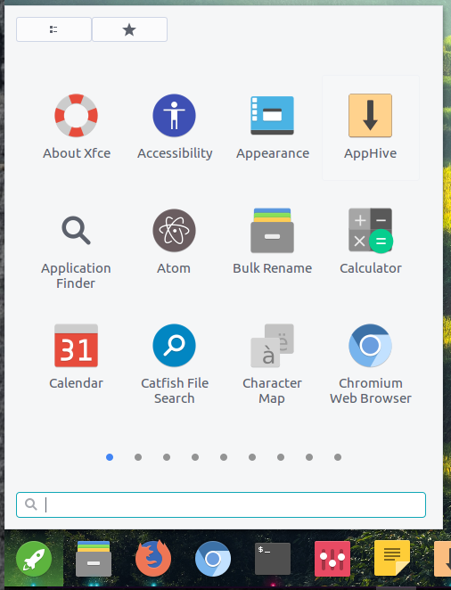

# launchy

## Installing and Running 

### Dependencies 

 	cmake
	libgee-0.8-dev
	libgnome-menu-3-dev
 	libgtk-3-dev
 	libjson-glib-dev
 	libplank-dev
 	libsoup2.4-dev
	libunity-dev
	libwnck-3-dev
	libzeitgeist-2.0-dev (optional)
	pkg-config
	valac

### Build and install 

Just type from a command line:

	mkdir build
	cd build
	cmake .. -DCMAKE_INSTALL_PREFIX=/usr
	make
	sudo make install
	./src/launchy
